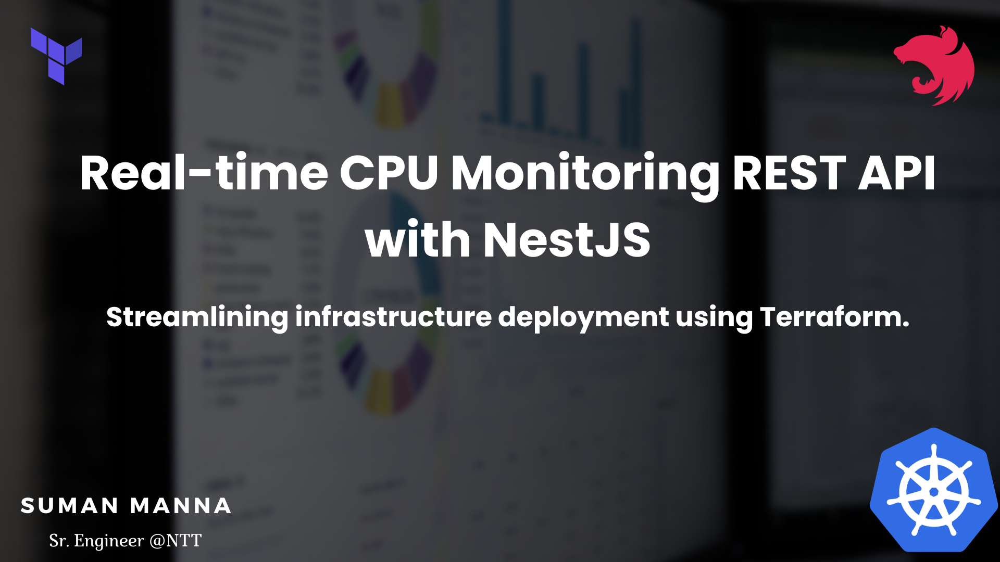
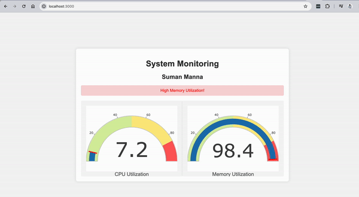

  <h3 align="center"></h3>

  <!--[](https://opencollective.com/nest#backer)
  [](https://opencollective.com/nest#sponsor)-->

## Description

This repository contains the source code for a Real-time CPU Monitoring REST API built with NestJS. The API provides seamless access to live CPU data, enabling users to monitor system performance in real-time. Additionally, the infrastructure setup for this project is simplified using Terraform.

## Features

- Real-time CPU data retrieval
- NestJS backend for robust performance
- Simplified infrastructure deployment with Terraform
- Easy integration into existing systems
- Comprehensive monitoring capabilities for enhanced efficiency

## Getting Started

Follow these steps to set up and deploy the API:

## Prerequisites

Node.js and npm installed on your machine.
Terraform CLI installed locally.

## Installation

#### Clone this repository to your local machine.

```bash
$ git clone https://github.com/sumanmanna134/cpu-realtime.git
```

#### Navigate to the project directory.

```
cd cpu-realtime
```

#### Install Dependencies

```
yarn
```

## Configuration

### Configure Terraform:

- Modify the terraform/main.tf file to specify your infrastructure details such as the AWS region, instance type, etc.

### Set environment variables:

- Create a `.env` file in the root directory and configure environment variables required for the NestJS application. You can use .env.example as a template.

## Deployment

Deploy Infrastructure with Terraform:

```
cd terraform
terraform init
terraform apply
```

Access the API at http://localhost:3000 by default.

## Running the app

```bash
# development
$ yarn run start

# watch mode
$ yarn run start:dev

# production mode
$ yarn run start:prod
```

## Test

```bash
# unit tests
$ yarn run test

# e2e tests
$ yarn run test:e2e

# test coverage
$ yarn run test:cov
```

## Demo



## Support

Nest is an MIT-licensed open source project. It can grow thanks to the sponsors and support by the amazing backers. If you'd like to join them, please [read more here](https://docs.nestjs.com/support).

## Stay in touch

- Author - [Suman Manna](https://blog.isumdev.com/)
- Linkedin - [@sumanmanna](https://www.linkedin.com/in/sumanmanna/)

## License

Nest is [MIT licensed](LICENSE).
